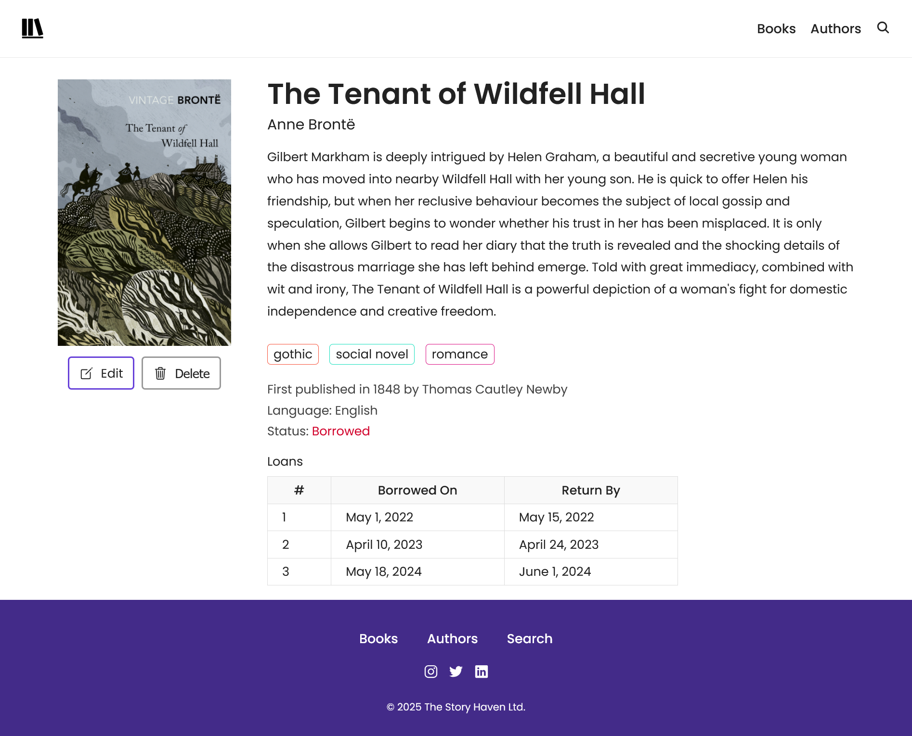

# Library Management System

Projekt knihovního systému vytvořený pomocí Node.js, Express a MongoDB jako semestrální práce pro univerzitu v období listopad–prosinec 2025.

Aplikace slouží pro správu databáze knih a autorů. Data jsou ukládána do NoSQL databáze MongoDB ve formě kolekcí (books a authors).

Projekt umožňuje:

- přidávání nových knih
- úpravu knih
- mazání knih
- zobrazování detailu knihy
- automatické vytvoření autora při přidání nové knihy s novým autorem

Projekt je napsán pomocí:

- Node.js
- Express
- MongoDB
- Mongoose
- Morgan
- Nodemon
- Vanilla JavaScript
- HTML + CSS

Do budoucna plánuji projekt rozšířit na plnohodnotnou knihovní aplikaci s:

- autentizací uživatelů
- možností půjčování knih
- React frontendem
- veřejně dostupnou live verzí

## Screenshoty




## Instalace a spuštění projektu

1. Naklonování repozitáře

```bash
git clone URL_REPOZITARE
cd library
```

2. Instalace dependencies

```bash
npm install
```

3. Vytvoření config.env

V kořenové složce projektu vytvořte soubor:

```bash
config.env
```

Do něj zkopírujte obsah souboru .env.example.

### Použití vzdálené MongoDB databáze

Pokud chcete použít vzdálenou MongoDB databázi:

1. Vyplňte:

```env
DATABASE
DATABASE_PASSWORD
```

2. Není potřeba upravovat server.js

### Použití lokální MongoDB databáze

Pokud chcete použít lokální MongoDB databázi:

1. Odkomentujte řádek v config.env

```env
DATABASE_LOCAL=local_db_connection_string
```

2. V souboru server.js

Odkomentujte:

```js
// const DB = process.env.DATABASE_LOCAL;
```

A zakomentujte:

```js
const DB = process.env.DATABASE.replace(
  '<PASSWORD>',
  process.env.DATABASE_PASSWORD,
);
```

### Import testovacích dat

Projekt obsahuje připravená testovací data knih a autorů ve formátu JSON.

Import dat

Z kořenové složky projektu spusťte:

```bash
cd dev-data
node import-dev-data.js --import
```

Smazání testovacích dat

```bash
node import-dev-data.js --delete
```

### Spuštění aplikace

Po připojení k databázi spusťte:

```bash
npm start
```

Aplikace poběží na http://localhost:8000

## Celkový vzhled aplikace


