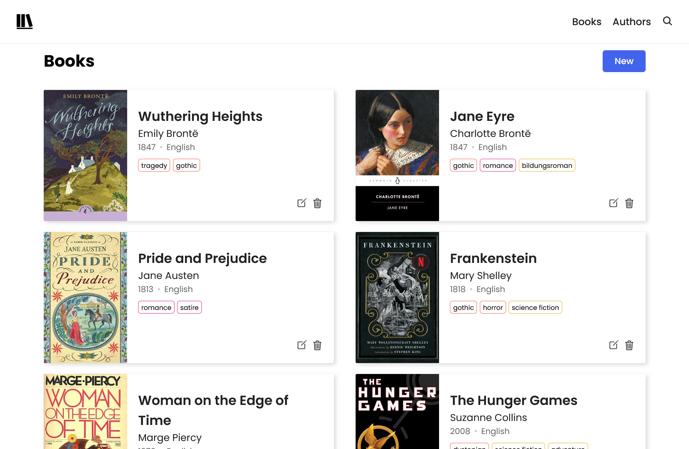
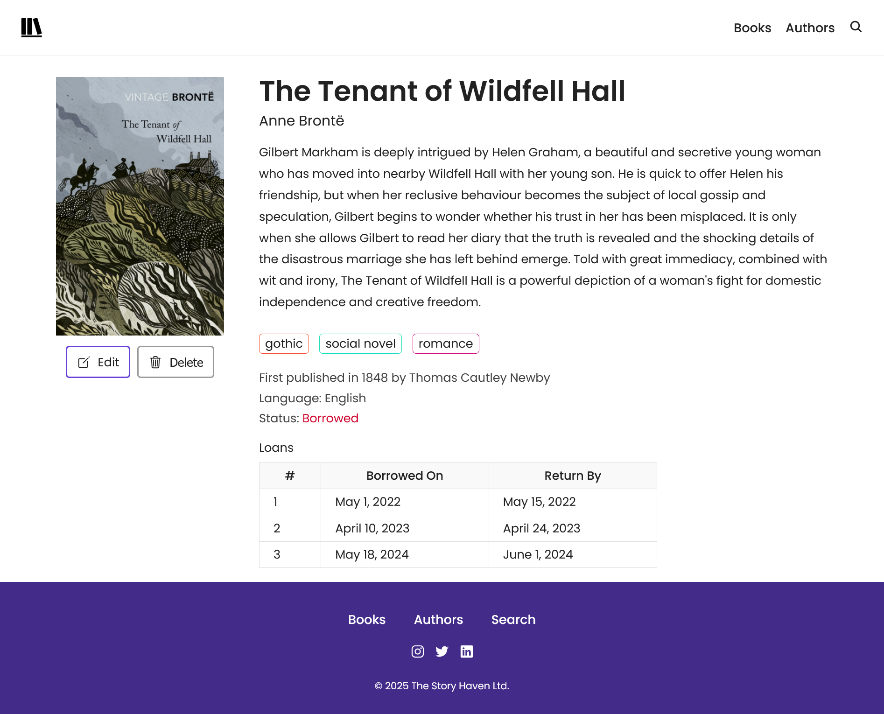

# Book Tracker App

🚧 Work in Progress
[Live Demo](https://library-fe-o700.onrender.com)

Book Tracker App je full-stack webová aplikace pro správu knih a sledování čtení vytvořená pomocí Reactu, Node.js, Expressu a MongoDB.

Projekt vznikl původně jako semestrální práce pro univerzitu v období listopad–prosinec 2025. Původní verze měla frontend vytvořený pomocí Vanilla JavaScriptu. Následně byl frontend kompletně přepracován do Reactu a projekt se postupně rozšiřuje z jednoduchého systému pro správu knih na plnohodnotnou knihovní aplikaci s uživatelskými účty, autentizací, autorizací a rozdílným rozhraním podle role uživatele.

Projekt je stále aktivně vyvíjen. Současná verze je nasazena na veřejném serveru, ale některé části uživatelského rozhraní a další funkce jsou stále ve vývoji.

## Funkce

### Knihy a autoři

- zobrazování seznamu knih
- zobrazování detailu knihy
- vyhledávání knih
- přidávání nových knih
- úprava knih
- mazání knih
- správa autorů
- automatické vytvoření autora při přidání knihy s novým autorem
- načítání dat z REST API
- loading a error states
- navigace pomocí React Routeru

### Uživatelé a autentizace

Aplikace nyní obsahuje kompletní základ uživatelské autentizace a autorizace:

- registrace uživatelů
- přihlášení uživatelů
- odhlášení
- autentizace pomocí JWT
- bezpečné hashování hesel pomocí bcrypt
- obnova přihlášeného uživatele po obnovení stránky
- ochrana privátních rout
- autorizace podle uživatelské role
- role client a admin

Autentizační stav je na frontendu spravován pomocí React Context API (AuthContext).

### Uživatelské rozhraní podle role

Aplikace používá rozdílné layouty a obsah podle typu uživatele:

- Nepřihlášený uživatel – veřejná landing page a veřejné části aplikace
- Client – uživatelské rozhraní zaměřené na sledování čtení a práci s knihami
- Admin – administrátorské rozhraní pro správu knihovny

Přístup k jednotlivým stránkám je řízen pomocí chráněných rout a autorizace podle role uživatele.

## Technologie

### Frontend

- React
- React Router
- JavaScript
- HTML
- CSS
- Vite

Frontend je rozdělen do znovupoužitelných komponent a využívá vlastní React hooks a Context API.

### Backend

- Node.js
- Express
- REST API
- MongoDB
- Mongoose
- JWT
- bcrypt
- Morgan
- Nodemon

Backend poskytuje API pro práci s knihami a autory a zajišťuje komunikaci s databází MongoDB.

## React frontend

Původní frontend aplikace byl vytvořen pomocí Vanilla JavaScriptu. V současné verzi byl frontend kompletně přepracován do Reactu.

Reactová verze využívá například:

- komponentovou architekturu
- React Router pro navigaci
- vlastní hooks pro práci s API
- Context API pro autentizaci
- chráněné a role-based routes
- samostatné layouty pro jednotlivé typy uživatelů
- znovupoužitelné komponenty
- řízení formulářů pomocí React state
- loading a error states
- oddělení API logiky od UI komponent
- dynamické vykreslování dat z databáze
- ScrollToTop pro správné chování navigace mezi stránkami

Například operace s knihami jsou odděleny do API vrstvy, zatímco vlastní UI je rozděleno do samostatných komponent a stránek.

## API

Backend poskytuje REST API pro práci s knihami.

Hlavní endpointy:

GET /api/v1/books
GET /api/v1/books/:id
POST /api/v1/books
PATCH /api/v1/books/:id
DELETE /api/v1/books/:id

Vyhledávání knih:

GET /api/v1/books/search?q=

API obsahuje také endpointy pro:

registraci uživatelů
přihlášení uživatelů
získání aktuálně přihlášeného uživatele

Autentizované endpointy jsou chráněny pomocí JWT a přístup k administrátorským funkcím je omezen podle uživatelské role.

## Aktuální stav projektu

🚧 Projekt je stále ve vývoji.

Základní backend, REST API, CRUD operace, autentizace, autorizace, role uživatelů a základní role-based frontend jsou již implementovány a aplikace je nasazena na veřejném serveru.

Aktuálně se zaměřuji především na další rozvoj frontendu a uživatelského prostředí. Mezi rozpracované části patří například:

- dokončení uživatelského účtu
- dokončení client dashboardu
- dokončení administrátorského dashboardu
- responsive web design
- další rozvoj client navigace
- vylepšení designu landing page
- vylepšení designu client dashboardu
- další úpravy UX a responzivity
- postupné rozšiřování funkcí knihovního systému

## Plánované rozšíření

Mezi další plánované funkce patří:

- půjčování a vracení knih
- historie výpůjček
- sledování průběhu čtení
- ukládání a správa knih uživatelem
- statistiky čtení
- doporučování knih
- rozšíření administrace knihovny
- další možnosti správy uživatelských účtů
- další vylepšení UX a vizuálního designu

## Screenshoty (stará verze)







## Instalace a spuštění projektu

1. Naklonování repozitáře

```bash
git clone URL_REPOZITARE
cd library
```

2. Instalace dependencies

Backend a frontend mají vlastní package.json, proto je potřeba nainstalovat dependencies pro obě části projektu.

Backend

```bash
cd backend
npm install
```

Frontend

```bash
cd ../frontend
npm install
```

3. Konfigurace backendu

V adresáři backend vytvořte soubor config.env
Do něj zkopírujte obsah souboru .env.example a doplňte potřebné hodnoty.

### Použití vzdálené MongoDB databáze

Pro použití vzdálené MongoDB databáze vyplňte:

```env
DATABASE=your_database_connection_string
DATABASE_PASSWORD=your_database_password
```

### Použití lokální MongoDB databáze

Pokud chcete použít lokální MongoDB databázi, nastavte:

```env
DATABASE_LOCAL=local_db_connection_string
```

a v server.js použijte lokální databázové připojení.

### Import testovacích dat

Projekt obsahuje připravená testovací data knih a autorů ve formátu JSON.

Import dat

Z kořenové složky projektu spusťte:

```bash
cd dev-data
node import-dev-data.js --import
```

Smazání testovacích dat

```bash
node import-dev-data.js --delete
```

### Spuštění aplikace

Backend

```bash
cd backend
npm start
```

Backend poběží na http://localhost:8000

Frontend

```bash
cd frontend
npm run dev
```

Vite následně zobrazí adresu, na které frontend běží, typicky http://localhost:5173

## Celkový vzhled aplikace


